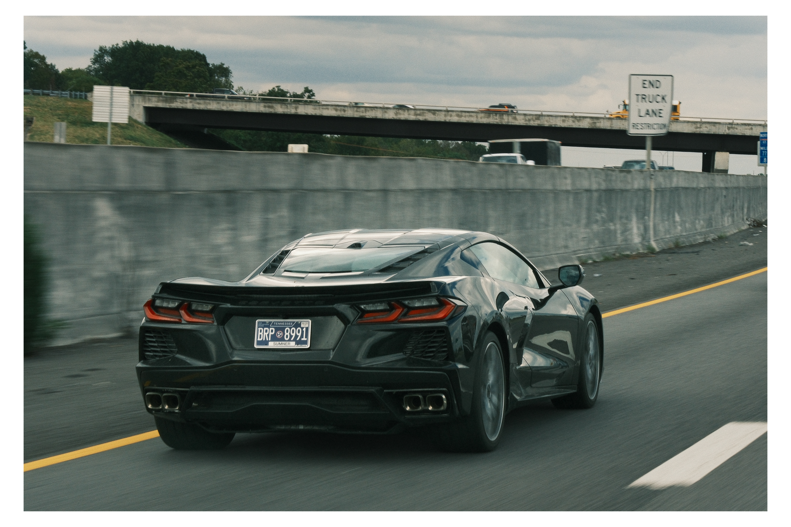
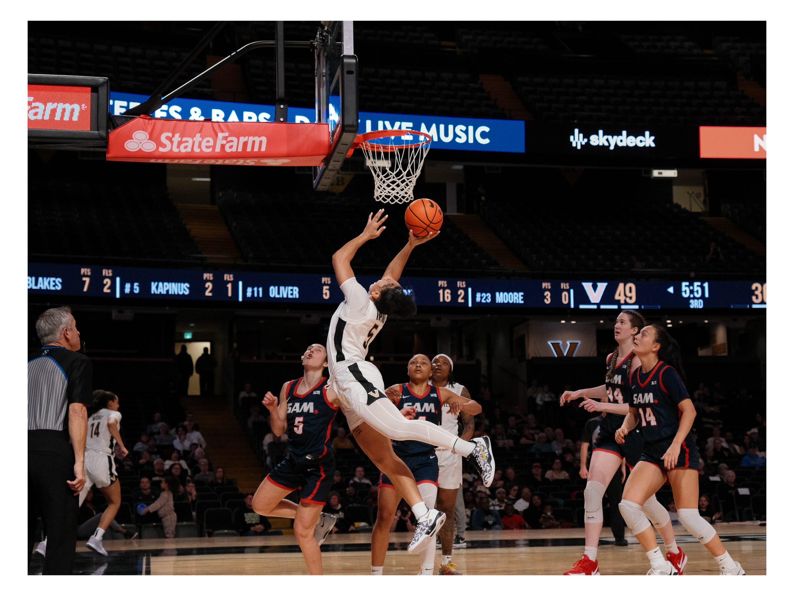

  

    

      
      

        <h5>Vroom vroom</h5>
        
Cool car in some road in Nashville.

      

    

    

      
      

        <h5>Vanderbilt Women's Basketball</h5>
        
Imagine she missed lol

      

    

    

      
      

        <h5>Black and White Portrait</h5>
        
Light and Shadows!

      

    

    

      
      

        <h5>Cold ECE Student</h5>
        
🥶 

      

    

    

      
      

        <h5>Canadian</h5>
        
Canadian student in natural habitat

      

    

  

  <a class="carousel-control-prev" href="#galleryCarousel" role="button" data-bs-slide="prev">
    
    Previous
  </a>
  <a class="carousel-control-next" href="#galleryCarousel" role="button" data-bs-slide="next">
    
    Next
  </a>

