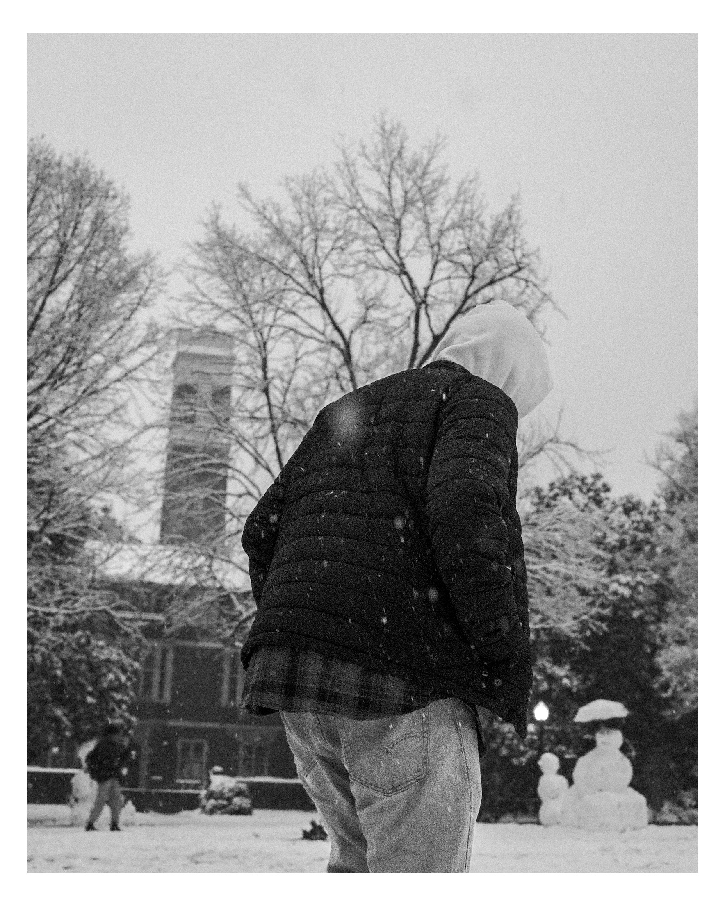

  

    
    
<strong>Vroom vroom</strong> Cool car in some road in Nashville.

  

  

    
    
<strong>Vanderbilt Women's Basketball</strong> Imagine she missed lol.

  

  

    
    
<strong>Black and White Portrait</strong> Light and Shadows!

  

  

    
    
<strong>Cold ECE Student</strong> 🥶

  

  

    
    
<strong>Canadian</strong> Canadian student in natural habitat.

  

